# Combine-Operators
List of operators in Combine Framework

# Transforming Operators

## Collect
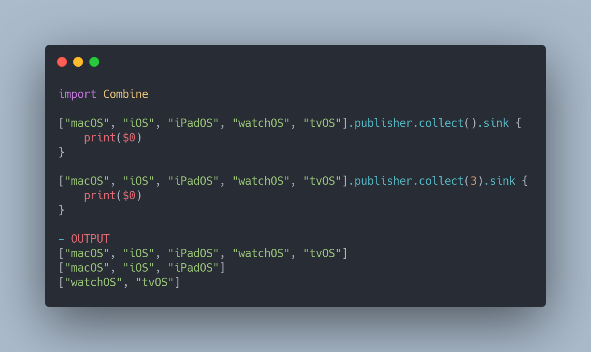

## Scan
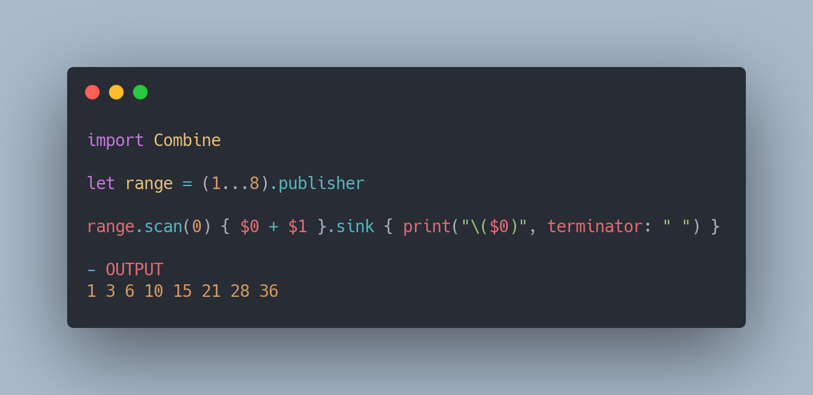

## Map
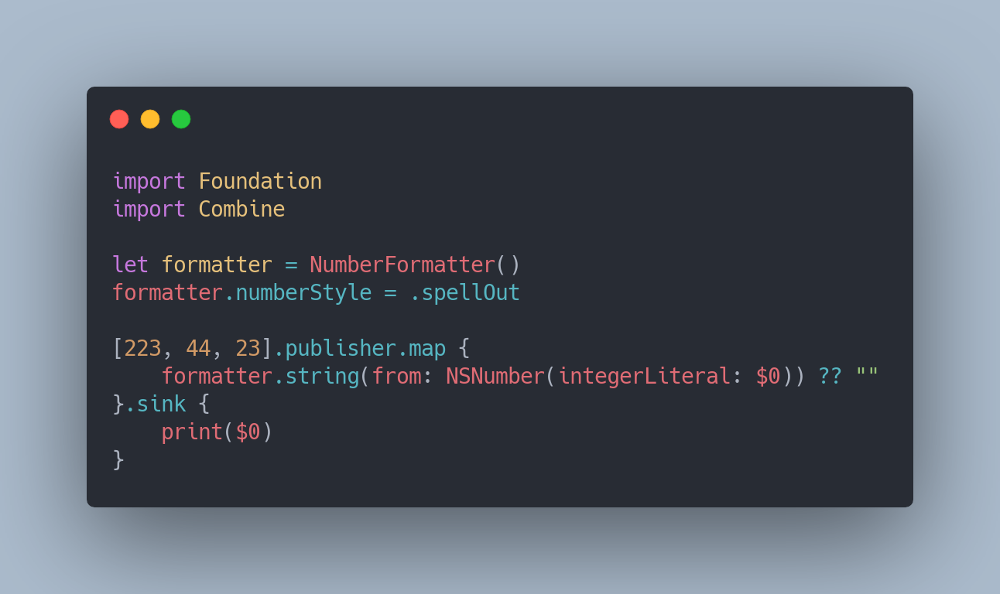

## Map KeyPath
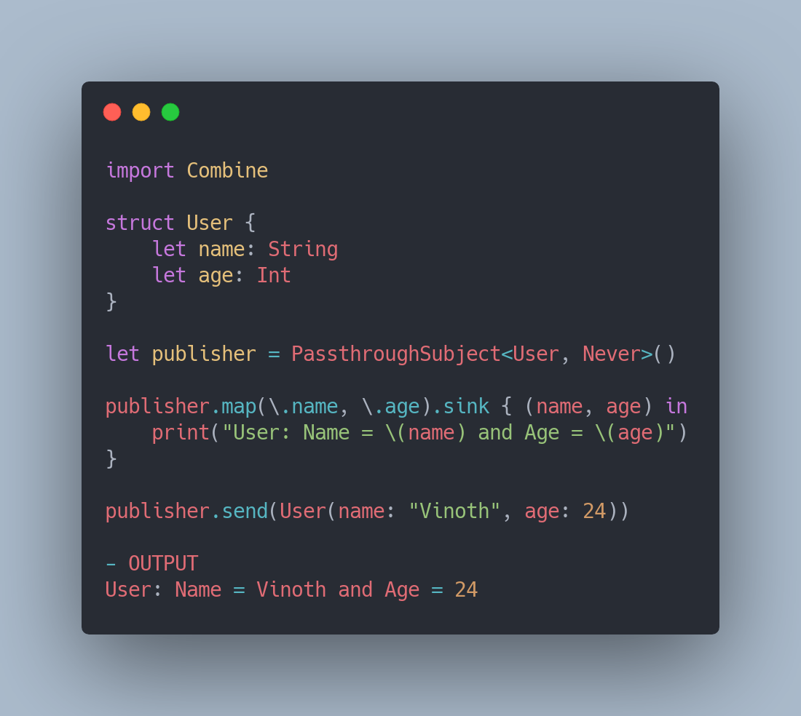

## FlatMap
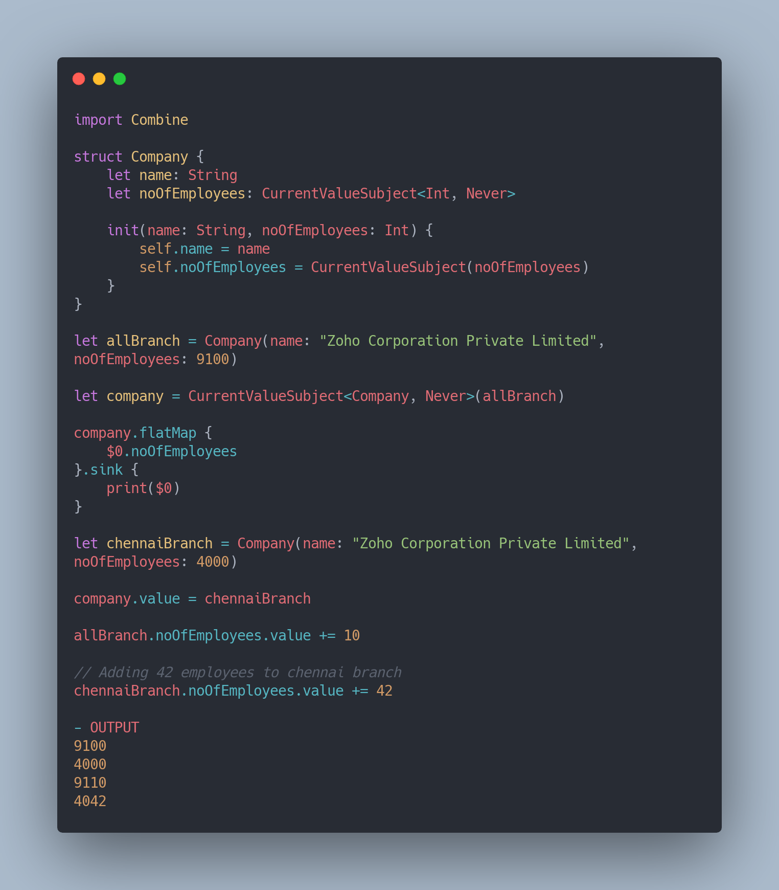

## ReplaceEmpty
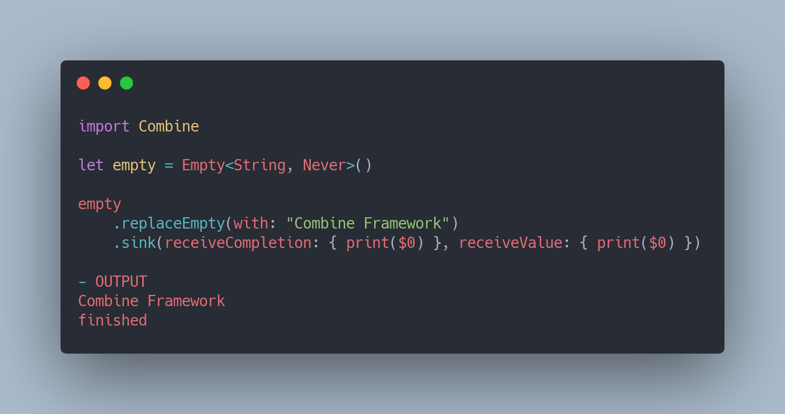

## ReplaceNil
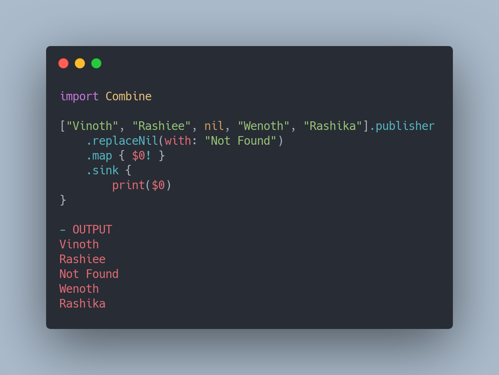

# Filtering Operators

## Filter
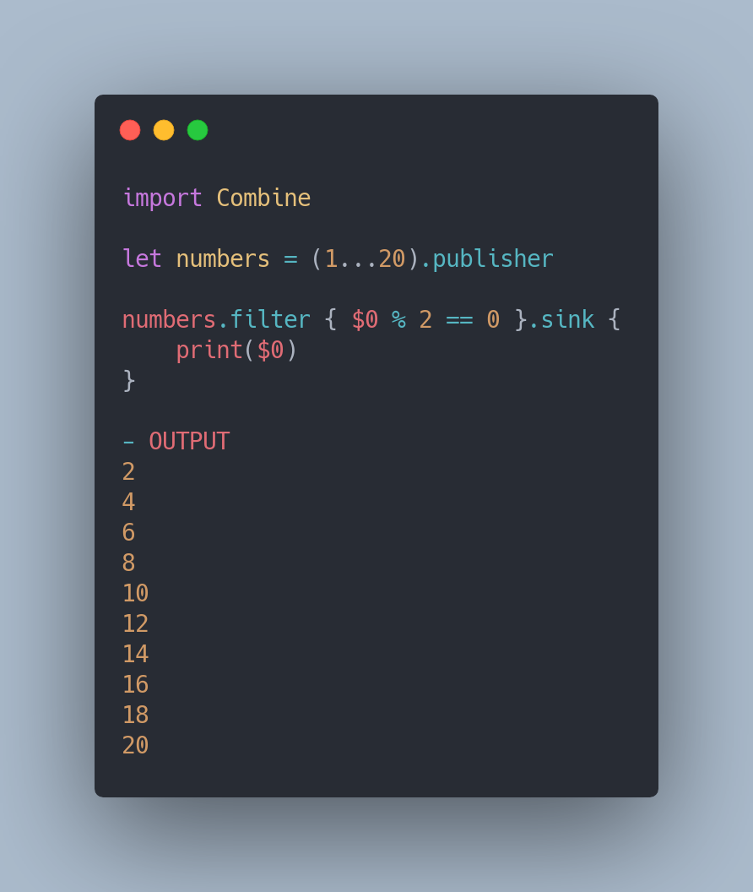

## CompactMap
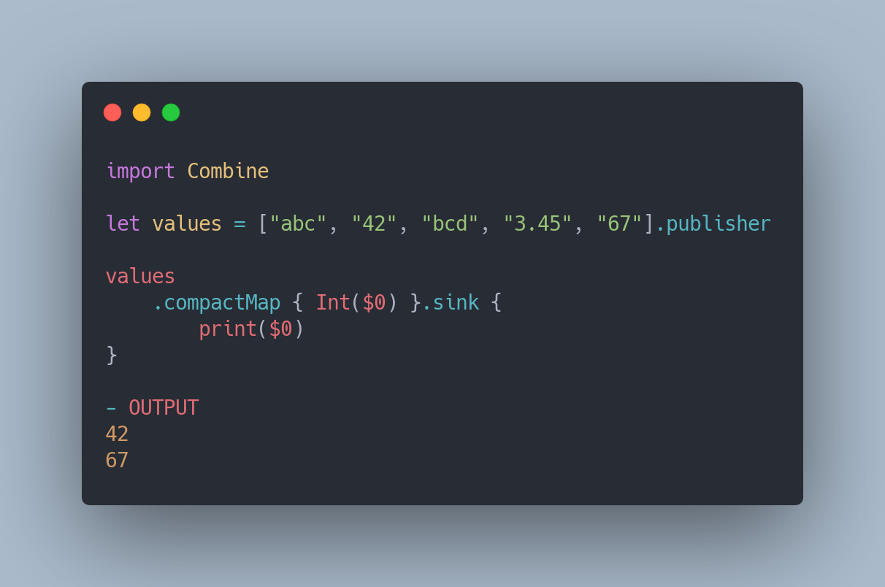

## IgnoreOutput

## First
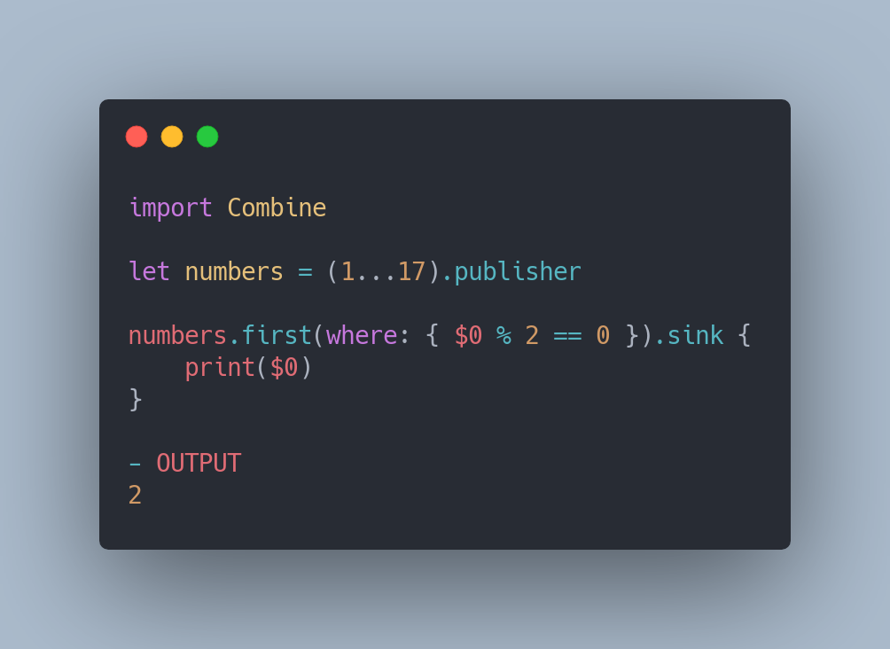

## Last
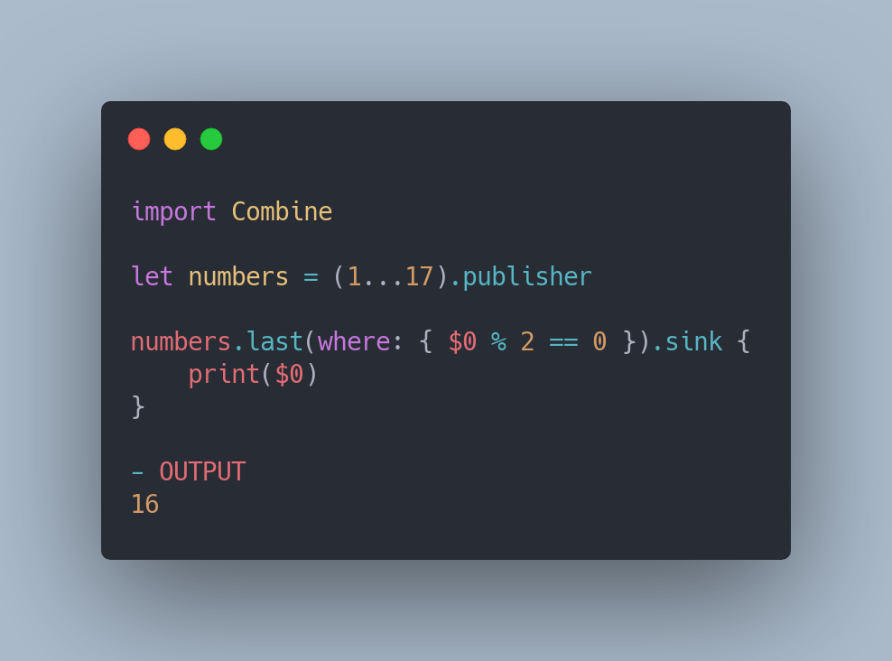

## DropFirst
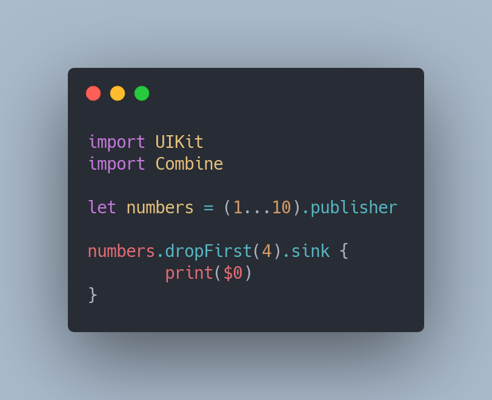

## DropWhile
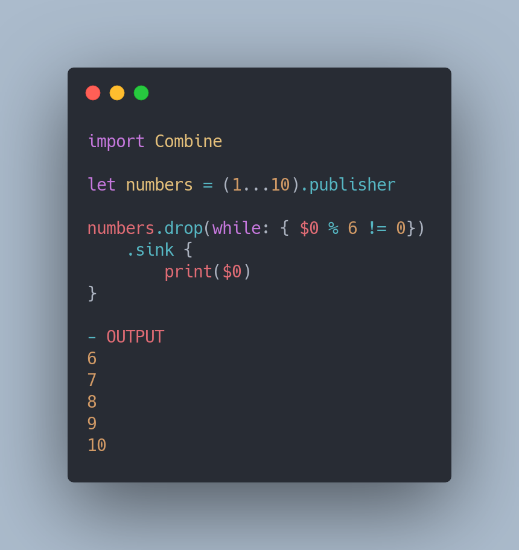

## RemoveDuplicates
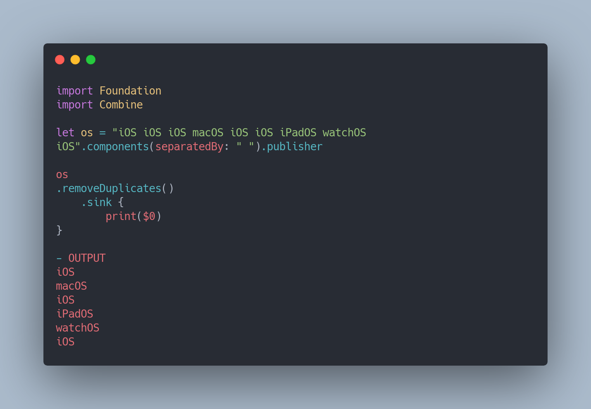
