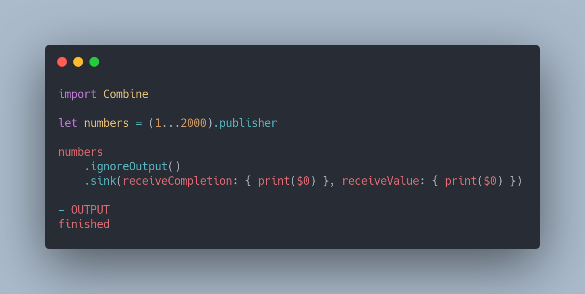
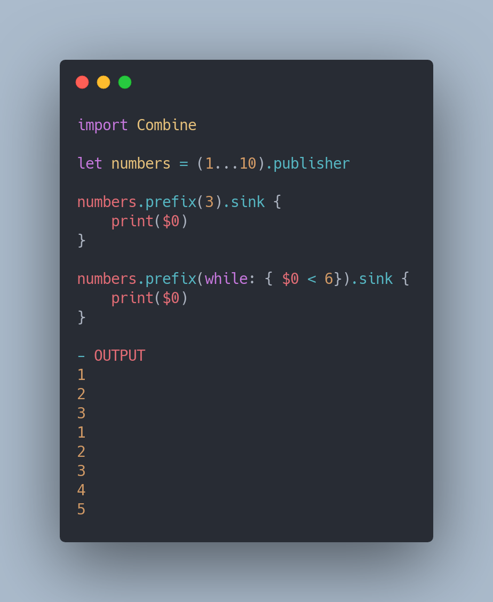

# Combine Operators
This is a collection of operators in Apple's Combine Framework

 

## Transforming Operators

* Collect

* Scan

* Map

* Map KeyPath

* FlatMap

* ReplaceEmpty

* ReplaceNil

## Filtering Operators

* Filter

* CompactMap

* IgnoreOutput

* First

* Last

* DropFirst

* DropWhile

* DropUntilOutputForm

* RemoveDuplicates

* Prefix

## Combining Operators

* Prepend

* Append

* SwitchToLatest

* Merge

* CombineLatest

* Zip

## Sequence Operators

* First and Last

* Min and Max

* Output

* Count

* AllSatisfy

* Contains

* Reduce

# Credits

* [The Complete Guide to Combine Framework in iOS Using Swift](https://www.udemy.com/course/the-complete-guide-to-combine-framework-in-ios-using-swift/)
* [Combine: Asynchronous Programming with Swift](https://store.raywenderlich.com/products/combine-asynchronous-programming-with-swift)
