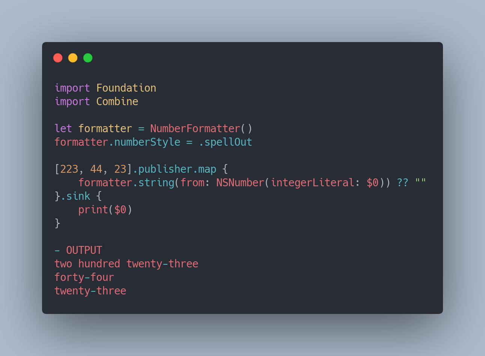

# Combine-Operators
List of operators in Combine Framework

# Transforming Operators

## Collect

## Scan

## Map

## Map KeyPath

## FlatMap

## ReplaceEmpty

## ReplaceNil

# Filtering Operators

## Filter

## CompactMap

## IgnoreOutput

## First

## Last

## DropFirst

## DropWhile

## RemoveDuplicates

