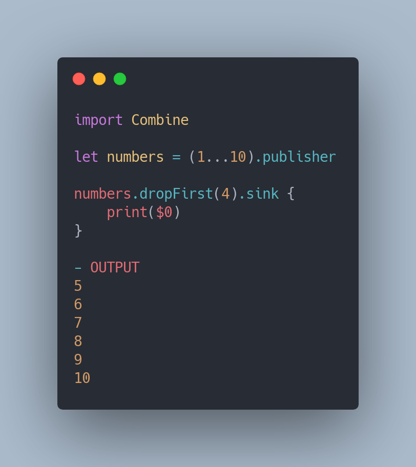
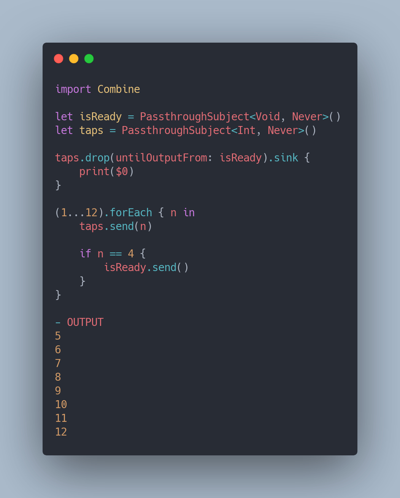
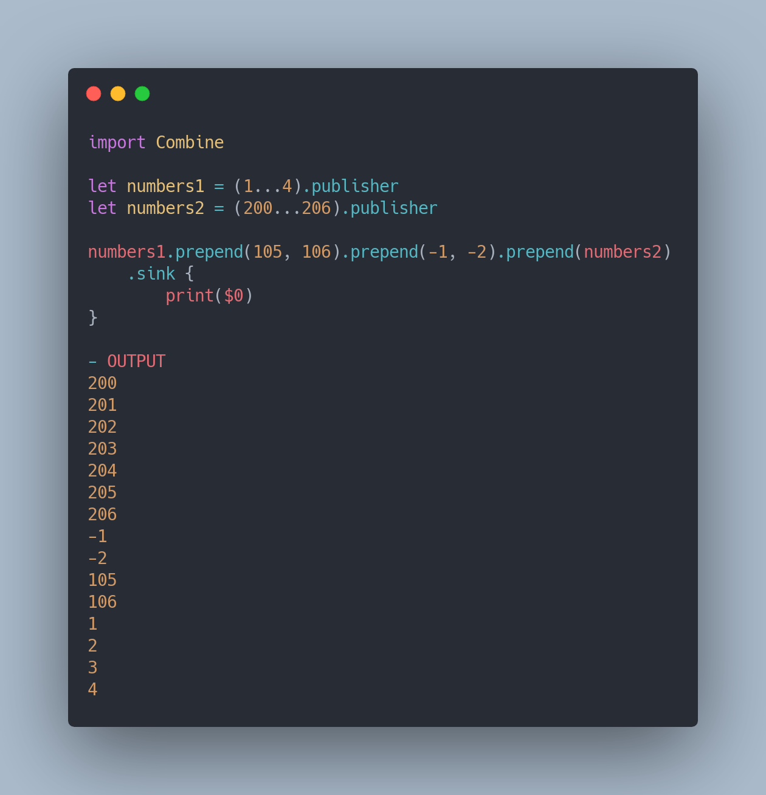
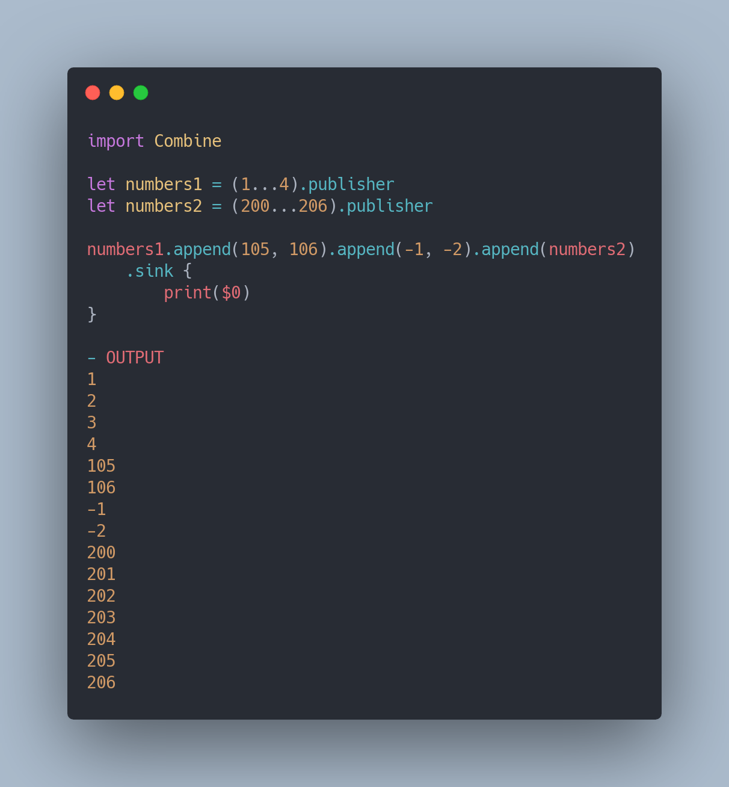
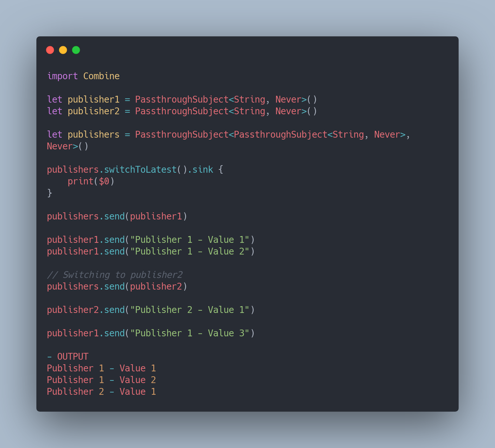
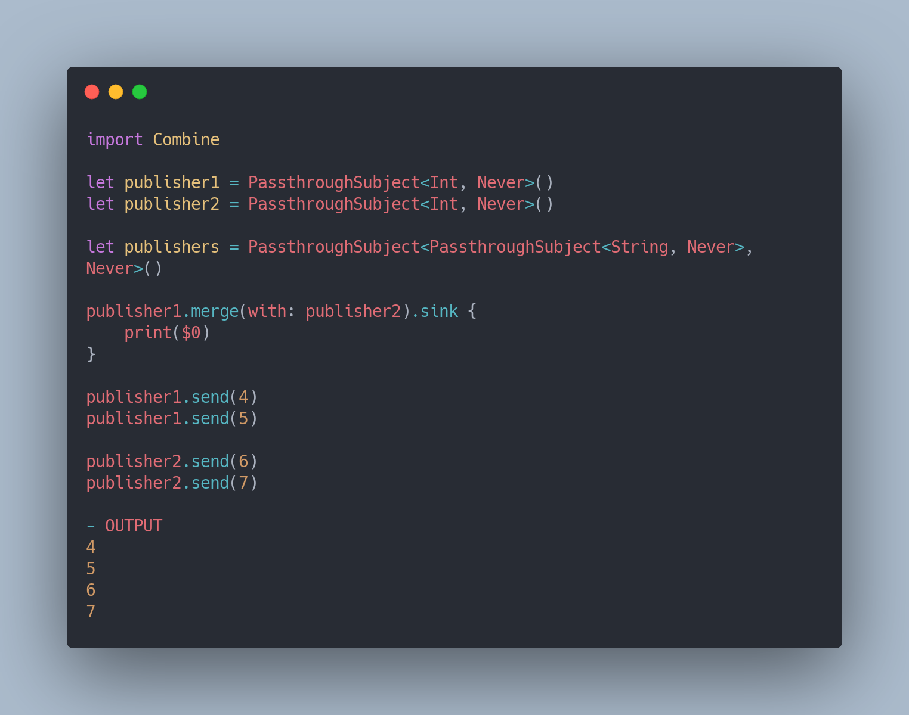

# Combine Operators
This is a collection of operators in Apple's Combine Framework

## Transforming Operators

* ### Collect

* ### Scan

* ### Map

* ### Map KeyPath

* ### FlatMap

* ### ReplaceEmpty

* ### ReplaceNil

## Filtering Operators

* ### Filter

* ### CompactMap

* ### IgnoreOutput

* ### First

* ### Last

* ### DropFirst

* ### DropWhile

* ### DropUntilOutputForm

* ### RemoveDuplicates

* ### Prefix

## Combining Operators

* ### Prepend

* ### Append

* ### SwitchToLatest

* ### Merge

* ### CombineLatest

# Credits

* [The Complete Guide to Combine Framework in iOS Using Swift](https://www.udemy.com/course/the-complete-guide-to-combine-framework-in-ios-using-swift/)
* [Combine: Asynchronous Programming with Swift](https://store.raywenderlich.com/products/combine-asynchronous-programming-with-swift)
